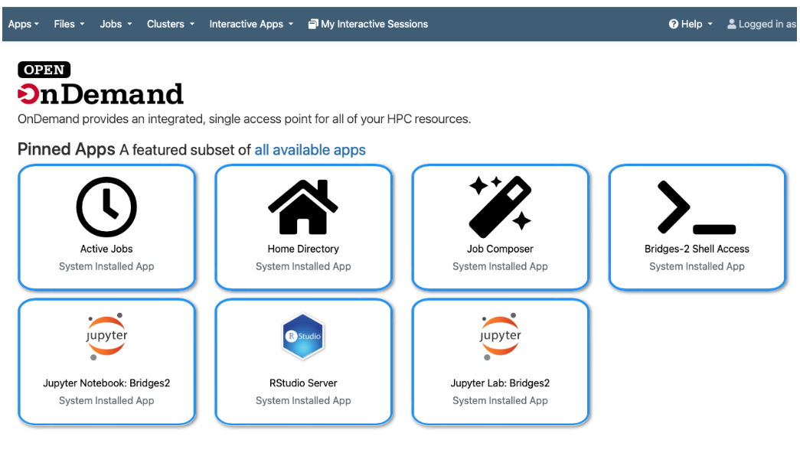
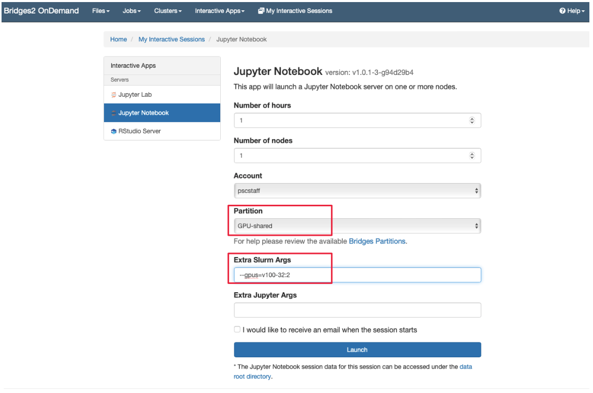
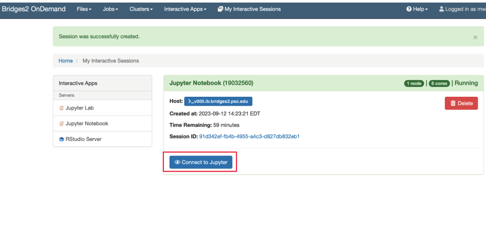
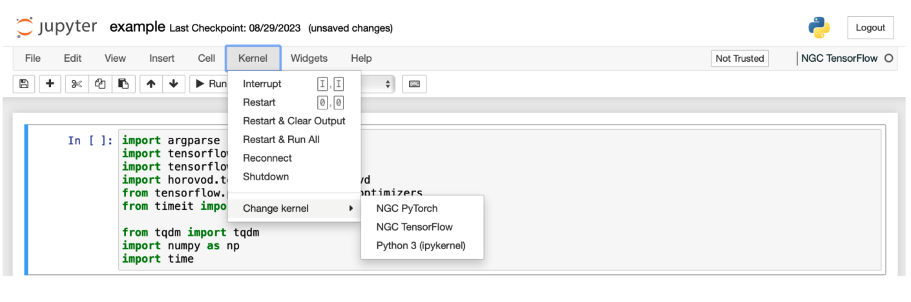

# Performing model finetuning/inference with Gemma on Bridges-2
Google provides many examples on their [website](https://ai.google.dev/gemma/docs) to help you get started using the Gemma models. Here, we select a few examples and demonstrate how to run them on Bridges-2.

## Using onDemand to run Jupyter Notebook
Please follow the steps below to run the example Jupyter Notebook [Gemma_lora_tuning.ipynb](Gemma_lora_tuning.ipynb) and [Gemma_distributed_tuning.ipynb](Gemma_distributed_tuning.ipynb) 
- Open [https://ondemand.bridges2.psc.edu](https://ondemand.bridges2.psc.edu) via a web browser. Enter your PSC username and password. Once logged in, you will land on a page as shown below. Click on the “Jupyter Notebook: Bridges2” icon or go to “Interactive Apps -> Jupyter Notebook” to start a run session.

- You will then land a web page, as shown below. Enter the information about your job, such as the requested time, number of nodes, and partition, and specify the number of GPUs using the “Extra Slurm Args” column (similar to the typical batch job). For running Llama, it is recommended to specify nodes with V100 32GB by adding the flag `--gpus=v100-32:n`, where `n` is the number of GPUs. For running [Gemma_lora_tuning.ipynb](https://github.com/meiyuw/bridges2-llm-examples/blob/main/Gemma/Gemma_lora_tuning.ipynb), it takes one V100 32GB GPU; while in the example of [Gemma_distributed_tuning.ipynb](https://github.com/meiyuw/bridges2-llm-examples/blob/main/Gemma/Gemma_distributed_tuning.ipynb), it assume two V100 32GB GPUs.
Then, you click the “Launch” icon to submit the job.

- You will then land on a page like the one shown below. The job may sit in the queue, waiting for resources for some time. Once the job starts, click the “Connect to Jupyter” to launch the Jupyter Notebook interface.

- The interface will be similar to a typical Jupyter Notebook, and you can navigate to the location of notebooks and open them. One easy way to set up an environment for running deep learning applications is to use NGC containers. You can select the latest Tensorflow NGC container on Bridges-2 from the tab at the top : “Kernel -> Change kernel -> NGC Tensorflow”. 

