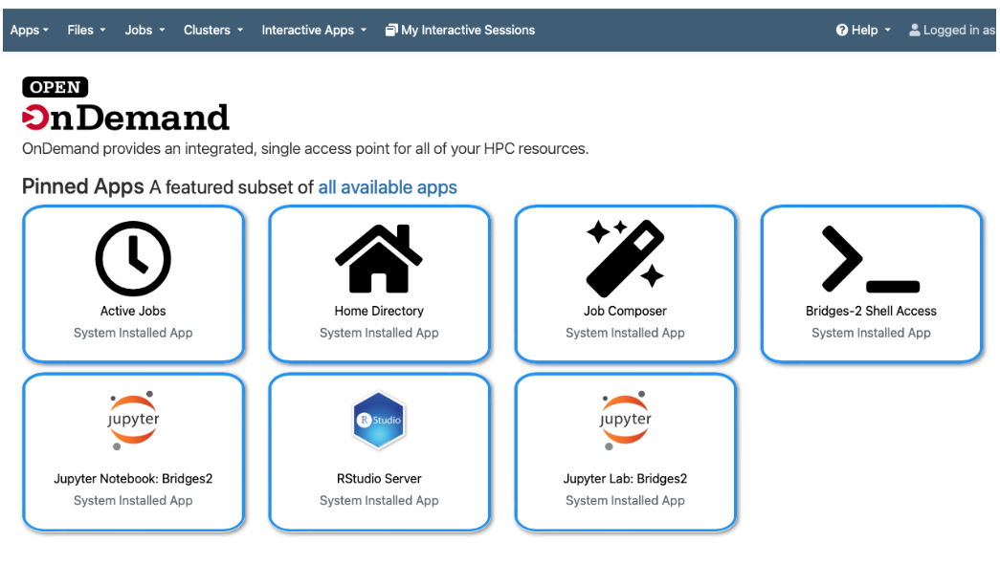
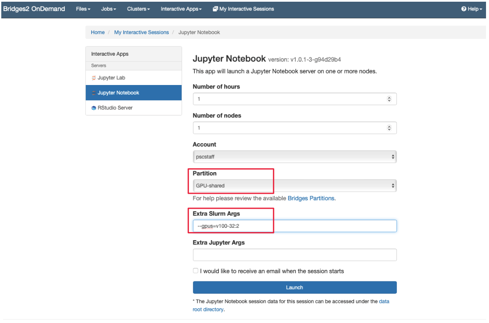
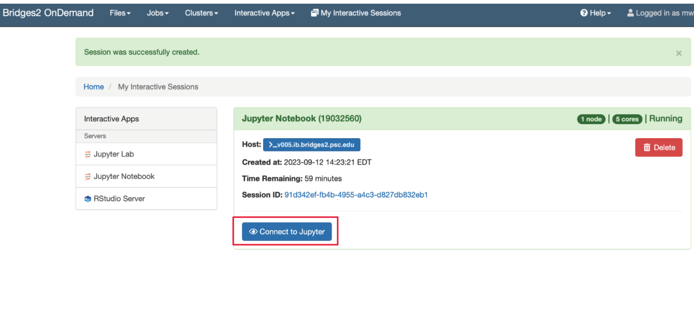
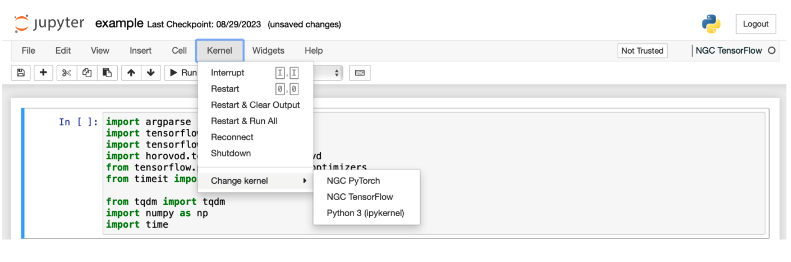

# Performing model finetuning/inference with Llama on Bridges-2
Meta already provides many examples of how to get started using the Llama models in the [llama-recipes](https://github.com/meta-llama/llama-recipes/) GitHub repository. Here, we select a few examples and demonstrate how to run them on Bridges-2.

## Download Llama model weights and model format conversion
- First, request access to Meta Llama by submitting [this form](https://llama.meta.com/llama-downloads) . This needs to be done whether you will download the model from meta directly or from other sites such as Kaggle or Hugging Face.
- If you plan to download from [Kaggle](https://www.kaggle.com/models/metaresearch/llama-3) or [Hugging Face](https://huggingface.co/meta-llama), please go to their website for requesting permissions as well. Please make sure the email you used for those sites are consistent.
- For weights downloaded from Meta (you will receive download links via email, and use the [download.sh](https://github.com/meta-llama/llama/blob/main/download.sh) script to download models), please convert to Hugging Face format if you plan to use Hugging Face's transformers library. Instructions can be found [here](https://github.com/meta-llama/llama-recipes/tree/main#model-conversion-to-hugging-face). However, if you download models from [Hugging Face hub](https://huggingface.co/meta-llama), where models with `hf` in the name are already converted to Hugging Face checkpoints, no further conversion is needed.
##Using onDemand to run Jupyter Notebook
Please follow the steps below to run the example Jupyter Notebook [Llama-demo.ipynb](https://github.com/meiyuw/bridges2-llm-examples/blob/main/Llama/Llama-demo.ipynb)
- Open [https://ondemand.bridges2.psc.edu](https://ondemand.bridges2.psc.edu) via a web browser. Enter your PSC username and password. Once logged in, you will land on a page as shown below. Click on the “Jupyter Notebook: Bridges2” icon or go to “Interactive Apps -> Jupyter Notebook” to start a run session.


- You will then land a web page, as shown below. Enter the information about your job, such as the requested time, number of nodes, and partition, and specify the number of GPUs using the “Extra Slurm Args” column (similar to the typical batch job). For running Llama, it is recommended to specify nodes with V100 32GB by adding the flag `--gpus=v100-32:n`, where `n` is the number of GPUs.
Then, you click the “Launch” icon to submit the job.


- You will then land on a page like the one shown below. The job may sit in the queue, waiting for resources for some time. Once the job starts, click the “Connect to Jupyter” to launch the Jupyter Notebook interface.

- The interface will be similar to a typical Jupyter notebook, and you can navigate to the location of notebooks and open them. One easy way to set up an environment for running deep learning applications is to use NGC containers. You can select the latest Pytorch NGC container on Bridges-2 from the tab at the top : “Kernel -> Change kernel -> NGC PyTorch”. 


## Interactive sessions

Here, we fine tune the Llama-2 7B model for a single epoch with one V100 32GB GPU. Make sure you enter the the correct Bridges-2 directory for the `--output_dir` and `--model_name`.
```bash
interact --partition GPU-shared --gres=gpu:v100-32:1
singularity shell --nv /ocean/containers/ngc/pytorch/pytorch_latest.sif
pip install llama-recipes
python3 -m llama_recipes.finetuning --use_peft --peft_method lora --num_epochs 1 --use_fp16 --use_wandb num_epochs 1 --quantization --model_name /your_project_dir/llama-2-7b-hf   --batch_size_training 1 --output_dir /your_project_dir/llama-2-7b-hf-finetuned
```

Fine tuning the Llama-3 8B model for a single epoch with two V100 32GB GPUs using the FSDP method. Make sure you enter the the correct Bridges-2 directory for the `--output_dir` and `--model_name`.
```bash
interact --partition GPU-shared --gres=gpu:v100-32:2
singularity shell --nv /ocean/containers/ngc/pytorch/pytorch_latest.sif
pip install llama-recipes
OMP_NUM_THREADS=4 torchrun --nnodes 1 --nproc_per_node 2  -m llama_recipes.finetuning --enable_fsdp --use_peft --peft_method lora --model_name /your_project_dir/llama-3-8b-hf/ --batch_size_training 1 --output_dir /your_project_dir/llama-3-8b-hf-finetuned
```
## Batch jobs
We provide an example slurm script for finetuning the Llama-3 8B model for a single epoch with two V100 32GB GPUs using the FSDP method. Please make sure to update the directory and account number in the slurm script before you submit the batch jobs using the following command:
```bash
sbatch llama3-8b-finetuning.sbatch
```

